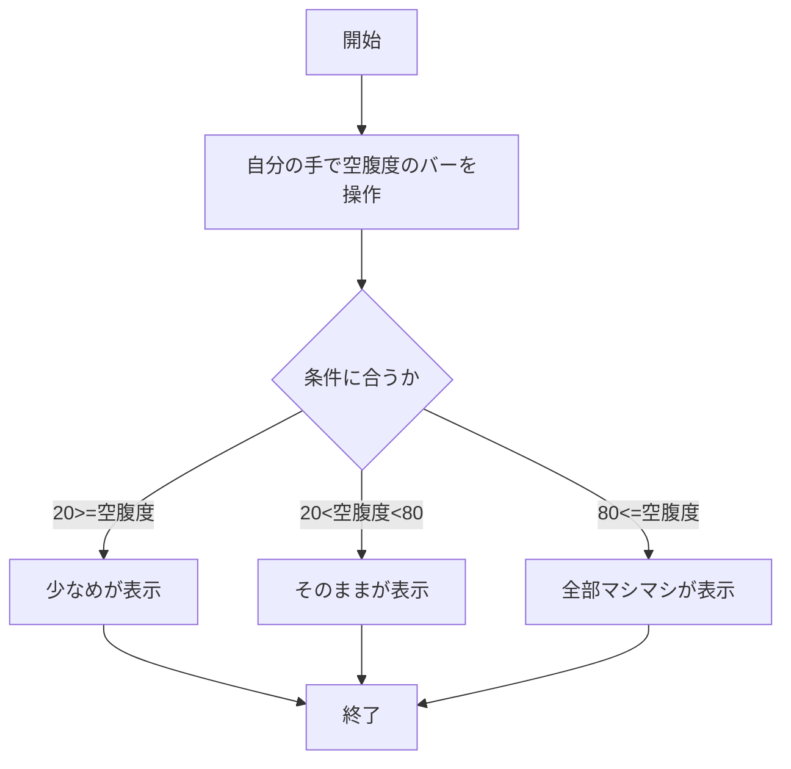
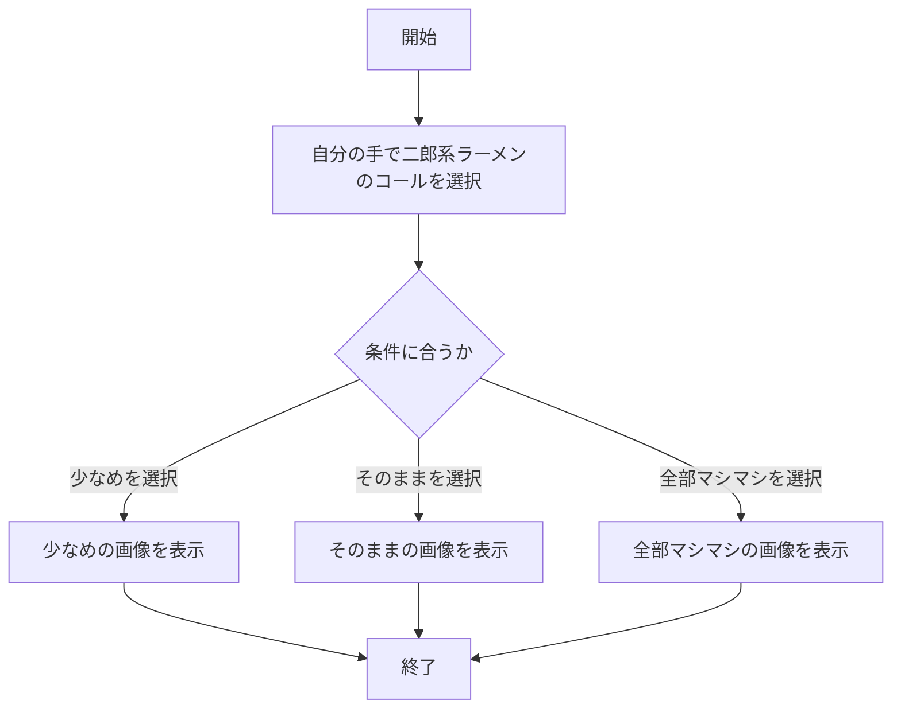

# webpro_06
## ファイル一覧
ファイル名 | 説明
-|-
app5.js | プログラム本体
public/kuufuku.html | 空腹度チェックの確認画面
views/kuufuku.ejs | 空腹度チェックのテンプレートファイル
public/jirou.html |二郎系ラーメンのコール選択画面
views/jirou.ejs |二郎系ラーメンのコールテンプレートファイル

## 空腹度チェックのプログラムについて
### このプログラムの説明
このプログラムは，入力された空腹度に応じておすすめの二郎系ラーメンのコールを教えてくれるプログラムである．以下に空腹度によるコール判定を示す.空腹度が80以上の場合changeに'全部マシマシ'を設定する．空腹度が20より大きく80より小さい場合changeに'そのまま'を設定する．空腹度が20以下の場合changeに'少なめ' を設定する．
### 空腹度に基づく条件分岐
``` javascript
  if ( value>=80 ){
    change = '全部マシマシ'
  }else if ( value>20 && value<80){
    change = 'そのまま';
  }else {
    change = '少なめ'
  }
```
### 実行方法
1. ```node app5.js``` を起動する
1. Webブラウザで[localhost:8080/public/kuufuku.html](http://localhost:8080/public/kuufuku.html)にアクセスする
1. 自分の手でバーを動かして空腹度を決める


### 1.フローチャート



## 二郎系ラーメンのコールのプログラムについて
### このプログラムの説明
このプログラムは，二郎系ラーメンのコールに応じてその画像を出力するプログラムである．以下に画像の選択肢をチェックする条件文を示す.
### 画像の選択肢をチェックする条件文
```javascript
  // コールの選択肢を確認
  if (selected == '1') {
    res.render('jirou', { filename: "./public/jirou.jpg", alt: "Jirou sokuname" });
  } else if (selected == '2') {
    res.render('jirou', { filename: "./public/jirou1.jpg", alt: "Jirou sonomama" });
  } else if (selected == '3') {
    res.render('jirou', { filename: "./public/jirou2.jpg", alt: "Jirou zenmashi" });
  } else {
    }
```

### 実行方法
1. ```node app5.js``` を起動する
1. Webブラウザで[localhost:8080/public/jirou.html](http://localhost:8080/public/jirou.html)にアクセスする
1. 自分の手で二郎系ラーメンのコールを選択する

### 2.フローチャート

