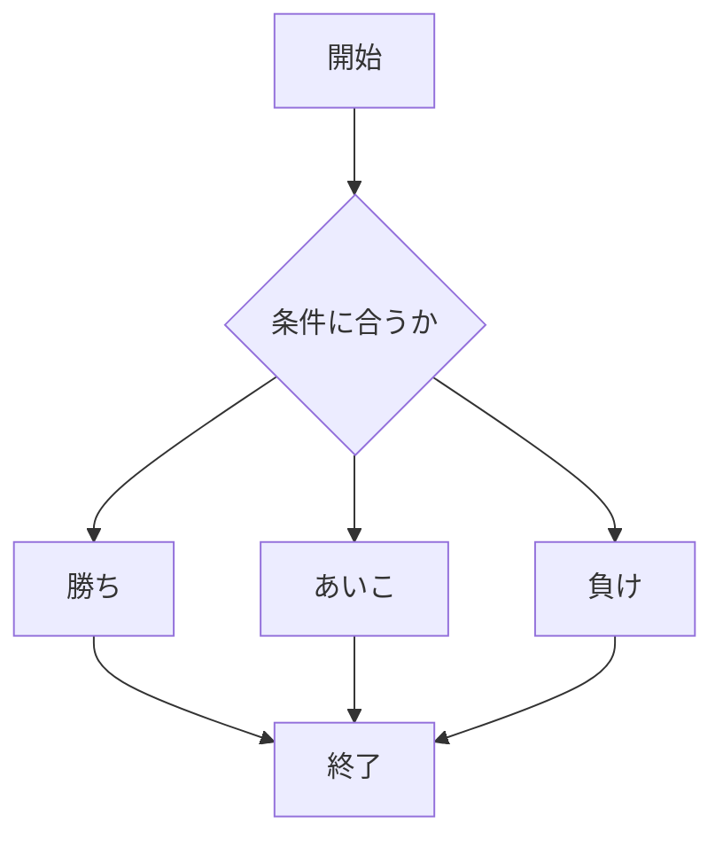
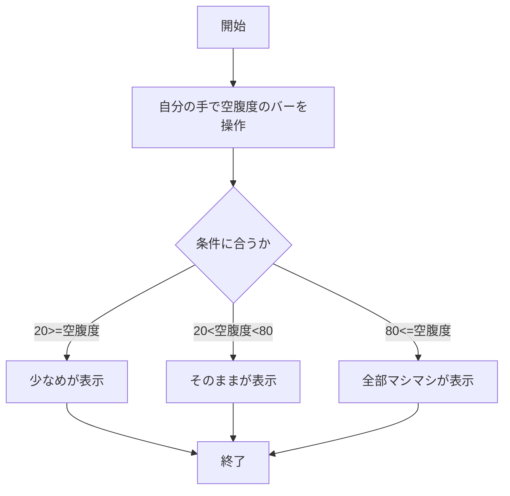
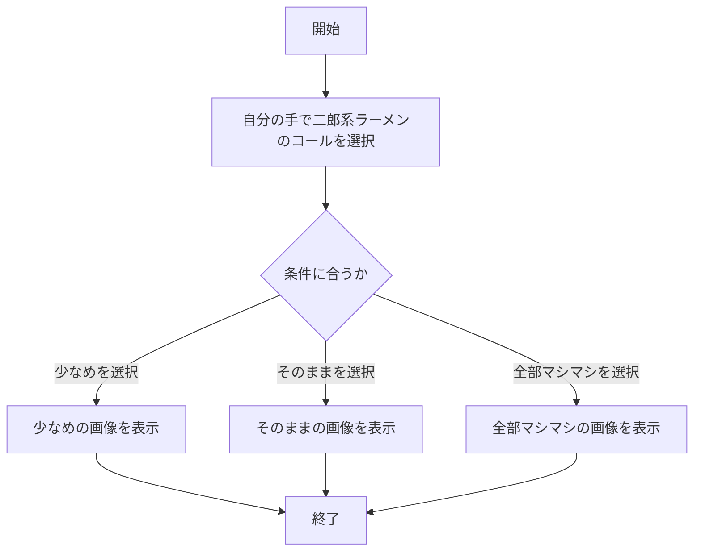

# webpro_06
## ファイル一覧
ファイル名 | 説明
-|-
app5.js | プログラム本体
views/icon.ejs | 画像表示のテンプレートファイル
views/luck.ejs | おみくじのテンプレートファイル
public/jyanken.html | じゃんけんの送信画面
views/jyanken.ejs | じゃんけんのテンプレートファイル
public/kuufuku.html | 空腹度チェックの確認画面
views/kuufuku.ejs | 空腹度チェックのテンプレートファイル
public/jirou.html |二郎系ラーメンのコール選択画面
views/jirou.ejs |二郎系ラーメンのコールテンプレートファイル

## アイコンのプログラムについて
### このプログラムにの説明
このプログラムは，ディレクトリ内の画像を表示するプログラムである．
### 実行方法

1. ```node app5.js```を起動する
1. Webブラウザで[http://localhost:8080/icon](http://localhost:8080/icon)にアクセスする

## おみくじのプログラムについて
### このプログラムの説明
このプログラムは，自分の運勢を調べてくれるプログラムである．以下にプログラムを示す．まず，random関数を用いてランダムな数を生成し，生成した数に応じてif文で運勢の制御を行っている．
```javascript
  const num = Math.floor( Math.random() * 6 + 1 );
  let luck = '';
  if( num==1 ) luck = '大吉';
  else if( num==2 ) luck = '中吉';
  else if( num == 3 ) luck = '小吉'
  else if( num == 4 ) luck = '末吉'
  else if( num == 5 ) luck = '凶'
  else if( num == 6 ) luck = '大凶'
res.render( 'luck', {number:num, luck:luck} );
```
### 実行方法
1. ```node app5.js```を起動する
1. Webブラウザで[http://localhost:8080/luck](http://localhost:8080/luck)にアクセスする
1. 左上のブラウザ再読み込みボタンを押しておみくじ実行

## じゃんけんのプログラムについて
### このプログラムについて
このプログラムは，コンピュータとじゃんけんをし勝ち負けを知ることができるプログラムである．以下に勝ち負けの判定を示す．random関数で生成した1~3までの数にそれぞれパー，グー，チョキを格納し，オペレーターから送信された情報を基にif文で勝敗の判定をしている．

```javascript
  let hand = req.query.hand;
  let win = Number( req.query.win ) || 0;
  let total = Number( req.query.total ) || 0;
  let probability = Number( req.query.probability ) || 0;
  console.log( {hand, win, total});
  const num = Math.floor( Math.random() * 3 + 1 );
  let cpu = '';
  if( num==1 ) cpu = 'グー';
  else if( num==2 ) cpu = 'チョキ';
  else cpu = 'パー';
  let judgement = '';
  if (num == 1) {
    if (hand == 'パー') {
      judgement = '勝ち';
    } else if (hand == 'グー') {
      judgement = 'あいこ';
    } else judgement = '負け'
  } else if (num == 2) {
    if (hand == 'グー') {
      judgement = '勝ち';
    } else if (hand == 'チョキ') {
      judgement = 'あいこ';
    } else judgement = '負け'
  } else if (num == 3) {
    if (hand == 'チョキ') {
      judgement = '勝ち';
    } else if (hand == 'パー') {
      judgement = 'あいこ';
    } else judgement = '負け'
  }
  ```
### 実行方法

1. ```node app5.js``` を起動する
1. Webブラウザで[localhost:8080/jyanken](http://localhost:8080/jyanken)にアクセスする
1. 自分の手でパー，グー，チョキを入力し送信

### フローチャート

## 空腹度チェックのプログラムについて
### このプログラムの説明
このプログラムは，入力された空腹度に応じておすすめの二郎系ラーメンのコールを教えてくれるプログラムである．以下に空腹度によるコール判定を示す.空腹度(value)が80以上の場合changeに'全部マシマシ'を設定する．空腹度が20より大きく80より小さい場合changeに'そのまま'を設定する．空腹度が20以下の場合changeに'少なめ' を設定する．
### 空腹度に基づく条件分岐
``` javascript
  if ( value>=80 ){
    change = '全部マシマシ'
  }else if ( value>20 && value<80){
    change = 'そのまま';
  }else {
    change = '少なめ'
  }
```
### 実行方法
1. ```node app5.js``` を起動する
1. Webブラウザで[localhost:8080/public/kuufuku.html](http://localhost:8080/public/kuufuku.html)にアクセスする
1. 自分の手でバーを動かして空腹度を決める


### フローチャート



## 二郎系ラーメンのコールのプログラムについて
### このプログラムの説明
このプログラムは，二郎系ラーメンのコールに応じてその画像を出力するプログラムである．以下に画像の選択肢をチェックする条件文を示す.selectedに'1'(少なめを選択)がある時には少なめの画像を表示．selectedに'2'(そのままを選択)がある時にはそのままの画像を表示．selectedに'3'(全部マシマシを選択)がある時には全部マシマシの画像を表示する．
### 画像の選択肢をチェックする条件文
```javascript
  // コールの選択肢を確認
  if (selected == '1') {
    res.render('jirou', { filename: "./public/jirou.jpg", alt: "Jirou sokuname" });
  } else if (selected == '2') {
    res.render('jirou', { filename: "./public/jirou1.jpg", alt: "Jirou sonomama" });
  } else if (selected == '3') {
    res.render('jirou', { filename: "./public/jirou2.jpg", alt: "Jirou zenmashi" });
  } else {
    }
```

### 実行方法
1. ```node app5.js``` を起動する
1. Webブラウザで[localhost:8080/public/jirou.html](http://localhost:8080/public/jirou.html)にアクセスする
1. 自分の手で二郎系ラーメンのコールを選択する

### フローチャート


