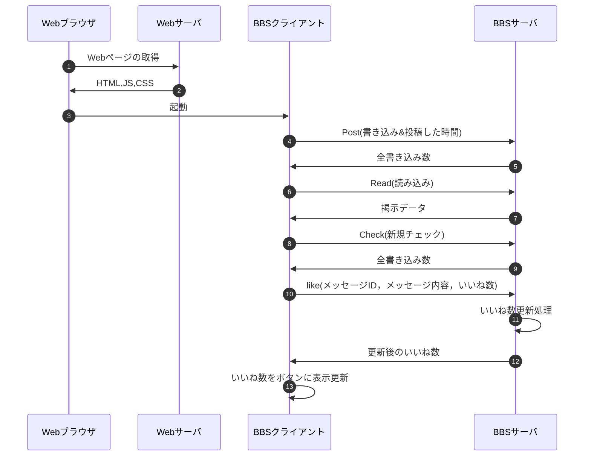

```mermaid
sequenceDiagram
  autonumber
  Webブラウザ ->> Webサーバ: Webページの取得
  Webサーバ ->> Webブラウザ:HTML,JS,CSS
  Webブラウザ ->> BBSクライアント:起動
  BBSクライアント ->> BBSサーバ:Post(書き込み&投稿した時間)
  BBSサーバ ->> BBSクライアント:全書き込み数
  BBSクライアント ->> BBSサーバ:Read(読み込み)
  BBSサーバ ->> BBSクライアント:掲示データ
  BBSクライアント ->> BBSサーバ:Check(新規チェック)
  BBSサーバ ->> BBSクライアント:全書き込み数
  BBSクライアント ->> BBSサーバ: like(メッセージID，メッセージ内容，いいね数)
  BBSサーバ ->> BBSサーバ:いいね数更新処理
  BBSサーバ ->> BBSクライアント:更新後のいいね数
  BBSクライアント ->> BBSクライアント:いいね数をボタンに表示更新
```